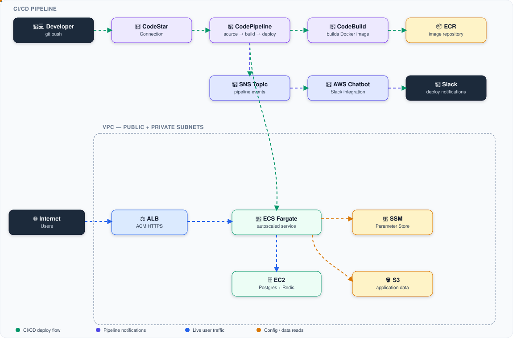

# ECS Terragrunt Deployment

Production-grade AWS infrastructure for running a containerized backend service (Node.js/NestJS style) on **ECS Fargate**, provisioned with reusable **Terraform modules** and orchestrated across environments with **Terragrunt**.

Built from real-world infrastructure I've deployed in my career, generalized here as a reference implementation — client-specific names, account IDs, and network details have been replaced with placeholders. Not a toy example: it includes HTTPS termination, autoscaling, a CI/CD pipeline with Slack notifications, encrypted remote state, and a self-hosted Postgres/Redis data tier.

## What it deploys

- **Networking** — VPC with public/private subnets across 2 AZs, security groups scoped per tier (ALB, ECS tasks, data tier)
- **ALB** — Application Load Balancer with optional HTTPS (ACM-issued cert) and path-based API routing rules
- **ECS Fargate** — containerized service with CPU/memory-based autoscaling (min/max task count), pulling images from a dedicated ECR repository
- **Data tier** — self-managed PostgreSQL + Redis on an EC2 instance (auto-generates its own SSH keypair, `terraform output` for the private key is marked `sensitive`)
- **CI/CD** — CodePipeline + CodeBuild wired to a CodeStar Connection (GitHub/Bitbucket source), building and deploying container images to ECS automatically, with Slack notifications via AWS Chatbot
- **Config/secrets** — SSM Parameter Store for backend environment variables (populated manually, never committed)
- **State & storage** — encrypted S3 buckets for Terraform remote state, pipeline artifacts, and application data

## Architecture



## Repository layout

```
.
├── modules/                 # Reusable Terraform modules
│   ├── networking/          # VPC, subnets, security groups
│   ├── acm/                 # TLS certificate
│   ├── alb/                 # Load balancer + listener rules
│   ├── ecr/                 # Container registry
│   ├── ecs/                 # Fargate service, task definition, autoscaling
│   ├── ec2-postgres/        # Self-managed Postgres/Redis data tier
│   ├── ssm/                 # Parameter Store for app config
│   ├── s3-data/             # Application data bucket
│   └── cicd/                # CodePipeline, CodeBuild, Chatbot/Slack
├── environments/
│   ├── dev/terragrunt.hcl   # Dev environment inputs
│   └── prod/terragrunt.hcl  # Prod environment inputs
├── terragrunt.hcl           # Root config: remote state backend, provider generation
├── provider.tf              # AWS provider (generated by Terragrunt at plan/apply time)
└── deploy.sh                # Convenience wrapper around terragrunt
```

Each environment is a self-contained Terragrunt unit that pulls in the same `modules/` source with different `inputs` — e.g. dev runs a single small Fargate task with a `t3.micro` data tier, prod runs 2-10 autoscaled tasks behind HTTPS with a `t3.large` data tier.

## Prerequisites

- [Terraform](https://www.terraform.io/) >= 1.0
- [Terragrunt](https://terragrunt.gruntwork.io/) >= 0.35
- [AWS CLI](https://aws.amazon.com/cli/) with a configured profile that has permissions to manage VPC, ECS, ALB, ACM, ECR, IAM, S3, SSM, CodePipeline/CodeBuild, and Chatbot resources

## Usage

1. **Set your AWS profile:**
   ```sh
   export AWS_PROFILE=default
   ```

2. **Deploy an environment:**
   ```sh
   cd ecs-terragrunt-deployment
   ./deploy.sh dev plan    # or ./deploy.sh dev apply
   ./deploy.sh prod plan   # or ./deploy.sh prod apply
   ```

3. **Manage backend environment variables:** the SSM parameter consumed by the ECS task is populated manually (AWS Console or CLI) — it is intentionally not defined in Terraform inputs to avoid secrets ever touching state or version control.

## Design notes

- **Remote state** is stored in S3, keyed per-environment (`${path_relative_to_include()}/terraform.tfstate`), with encryption enabled.
- **No secrets in code**: `.gitignore` excludes `*.tfvars`, `*.tfstate`, `.env`, and key material. Passwords and connection strings live in SSM, set out-of-band.
- **EC2 key pairs** are generated by Terraform itself (`tls_private_key`); the private key output is marked `sensitive` so it never appears in plaintext CLI output.
- **Admin access** (SSH, direct DB port) is restricted via `admin_cidr_blocks` — set this to your own IP range before applying; the example value is a documentation-only placeholder.
- **Session Manager**-friendly: the EC2 data-tier instance is reachable via AWS SSM Session Manager without opening broad SSH access.

## License

MIT License. See [LICENSE](LICENSE) for details.
